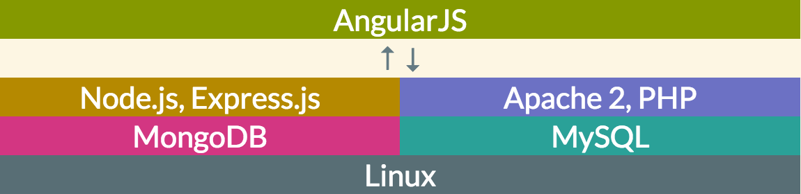
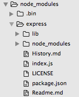
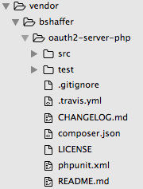
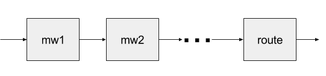
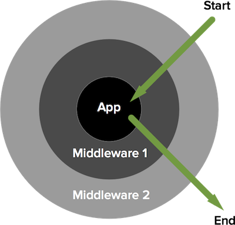

# Use Report of MEAN stack and LAMP stack

## Abstract

MEAN stack is one of the most recent and popular web solution widely used now.
Meanwhile LAMP stack is one of the oldest ones, however this does not prevent people from using it in a modern fashion.

In this report, I am going to compare my working experience of both MEAN stack and LAMP stack as a web developer.
Due to heavy setup and configuration processes for LAMP stack, I believe MEAN stack is easier to learn and work with, especially for new developers.

## Introduction

During at least passed 5 years, Node.js as a javascript server-side solution becomes more and more popular for its light weight and easiness of use.
And MEAN stack solution also becomes lots of developers' first choice for building web applications.

On the other hand, LAMP stack is one of the oldest solution used for web applications, which has been used more than 20 years.
However, it is not abandoned because of its age. It has been improving, and now it is used in a modern fashion to build web applications.

MEAN stack includes:
  - AngularJS (front-end framework)
  - Express (HTTP framework)
  - Node.js (Javascript Engine)
  - MongoDB (Database)

LAMP stack incldues:
  - PHP
  - Apache2 (server)
  - MySQL (Database)
  - Linux

In either stack, each letter represents a software. However, these softwares are not one-to-one connected between stacks.
For example, in MEAN stack, A represents AngularJS [1], which is a front-end framework running in client side.
It does not care what technologies server-side is using. It can work with either Node.js server or a Apache-PHP server.
Meanwhile, in LAMP stack, L represents Linux [2]. In most case, MEAN stack server also running on a Linux.
The stack layers can be redraw as below.



Furthermore, MongoDB [3] is a non-relational database, while MySQL [4] is a relational data. The difference between non-relational databases and relational database is out the scope of this report.
So we will talk about the difference on their interaction with server framework for two databases.

In the following sections, I will compare MEAN stack and LAMP stack, and address the difference in an order of learning process.
This means as a new developer to either stack, we will learn and compare both stacks on following point:
  - [Environment setup](#environment-setup)
  - [Dependency management](#dependency-management)
  - [HTTP Server](#run-http-server)
  - [Serve static files](#serve-static-files)
  - [RESTful API](#expressjs-vs-slim-3)
  - [Middleware](#middleware)
  - [DB interactions](#database-interactions)
  - [Template Engine](#template-engine)

### Environment Setup

Before we can do anything, we need to setup the development environment for each stack.

The installations for either MEAN stack or LAMP stack on a Linux would involve bunch of commands, reboots and configurations.
To make life easier, I use docker and two popular docker images.
  - [rmukhia/im-meanjs](https://hub.docker.com/r/rmukhia/im-meanjs/) [5]
  - [linode/lamp](https://hub.docker.com/r/linode/lamp/) [6]

### Dependency Management

After the development environments have been setup, we can start building our web app.
In order to build a web app, some libraries are often need to be install before we can actually write some code.

MEAN stack use npm [7] to install, delete and manage the dependency libraries, while LAMP stack use Composer [8].

#### Adding libraries

Both npm and composer use a json formatted file to let developer specify the dependencies libraries and their versions.
npm's dependencies specification file is called ```package.json```, while composer's is called ```composer.json```.

To install the libraries, for MEAN stack, run:
```bash
$ npm install
```
while for LAMP stack, run:
```bash
$ composer install
```

When running the above commands, both npm and composer would create a folder to store all the dependencies.
For MEAN stack, the folder is called ```node_modules```. For LAMP stack, it is celled ```vendor```.

Composer also generates a JSON file called ```composer.lock```. This file stores a list of exact versions  it installed.
When ```composer install``` got run, it will check if there is a ```composer.lock``` file first.
If there is, it will use ```composer.lock``` to install the dependencies, instead of using ```composer.json```, since the versions are more accurate.

#### \*Dependencies of Dependencies
Let's take a close look at node_modules directory and vendor directory.




As shown above, inside each node_modules library directory, there will be a ```package.json``` file and another ```node_modules``` directory. Node_modules are nested. However, there is only one ```vendor``` folder among the while project.

This means, for npm, each node_module library has its own dependencies, and the dependencies structure is like a tree. For composer, the vendor folder can not be nested, such that the dependencies structure is flat. vendor libraries need to share dependencies if they have.

### Run HTTP Server

Now we setup the environments and installed dependency modules. Finally, we can run a simple HTTP server.

#### Express Server

For MEAN stack, we are building a HTTP server using Express framework [9].
(Node.js is not a server, instead it is a Javascript runtime.)

```javascript
var express = require('express');
var app = express();

app.listen(3000, function () {
  console.log('Server start listening on port 3000!');
});
```

#### Apache2 Server

For LAMP stack, Apache 2 [10] is used as a HTTP server.
With the use of docker and linode/lamp image, we could save some work on configuring Apache 2 server.
(PHP is also not a server. Apache 2 runs PHP scripts)

Under Linux, Apache 2 runs as a daemon. So it can be started using command line:
```
$ service apache2 start
```

### Serve Static Files

So far both servers are running, and we can serve something from those servers.
The very first thing we need to serve is static files, such as css files javascript files and even the whole AngularJS app.

#### Express Server

For MEAN stack, Express framework uses a middleware to serve the static files [11].

```javascript
app.use(express.static(path.resolve('./public')));
```

#### Apache2 Server

By default, if we go to http://example.com/script.php, Apache2 runs the script stored in ```root/script.php```, and response the result.
If there is no PHP script define inside ```script.php```, Apache2 will just return the content of the file.
This is exactly what we need to serve static files.

### Express.js vs. Slim 3

Now, we can use browser to go to ```path/to/file```, and the server will serve the static file.
Next, we are going to build some server features for both stack, such as RESTful API, middleware and Database interactions.
In order to do this easier, for LAMP stack, it is better to use some PHP micro framework. There are dozens of PHP framework.
Here, in this report, I am going to use one of the newest ones called Slim 3.

#### Create an Application

Express [9]
```javascript
var express = require('express');
var app = express();
```

Slim 3 [12]
```php
<?php
$app = new \Slim\App;
?>
```

#### Routes & Router

At first, to make RESTful API, at least we need to separate different HTTP methods for the same URI.

##### Express
```javascript
app.get('/users', function (req, res) {
  res.send('GET users');
});

app.post('/users', function (req, res) {
  res.send('POST users');
});

// or you can pack different methods handle into controllers
app.route('/users')
	.get(function (req, res) {
    res.send('GET users');
  })
	.post(function (req, res) {
    res.send('POST users');
  });
```

##### Slim 3:
```php
<?php
$app->get('/users', function ($request, $response, $args) {
    ...
    return $response;
});

$app->post('/users', function ($request, $response, $args) {
    ...
    return $response;
});

// or you can pack different methods handle into controllers
$app->any('/users', 'UserController');
?>
```

With only this snippet of code, the routes would not work as we expect.

As we mentioned above, by default, Apache server will directly serve the file or run the script with the path specified in the URL.
However, to make RESTful API, the URL doesn't have to represents a file or a script store as file locating somewhere in the file system.
More generally, a URL would represents a resource store in the database.
For example, in above case, ```users``` is not a file, but a tables/resource store in the database.

In this case, we need to let Apache server know that when it see URL like ```/users```, don't try to find a file called ```users```, instead run a script called ```index.php``` in which contains above code. (Let's assume above code is stored in a file called ```index.php```)

###### URL Rewriting

In LAMP stack, we use a configuration file called .htaccess to let Apache2 server know our special arrangement for this situation.
.htaccess is used to control the access of the server to the director .htaccess under and its subdirectory.
This is where we are going to define the URL rewriting rules we address above. [13]

```
RewriteEngine On
RewriteCond %{REQUEST_FILENAME} !-f
RewriteCond %{REQUEST_FILENAME} !-d
RewriteRule ^ index.php [QSA,L]
```
- The first line tells the server to enable the URL rewriting under this directory.
- The second and third lines define two conditions under which the following rewriting rules would applied.
- The fourth line defines the rewriting rule.

Overall, this .htaccess file tells the Apache server, if the REQUEST_FILENAME is not found under this directory, run index.php instead.
By this way, the router pattern becomes possible with Apache server.

#### Middleware

There are always some code, for different reasons, we neither want to put it into routes nor want to call it from the routes.
(In most cases, the code is used multiple time or it is irrelevant to the routes business logic.)
Middleware is introduced. Middleware works as extra layers of code server need to run before/after it runs your routes code.

##### Express [14]
```javascript
// middleware for /users/:name
app.use('/users/:name', function (req, res, next) {
    // middleware 1
    next();
  }, function (req, res, next) {
    // middleware 2
    next();
  },
  ...
);
// routes for /users/:name
app.get('/users/:name', function (req, res) {
  res.status(200).send();
});
```

The way Express handle middleware is it chains them up.
After finishing each middleware, developer need to explicitly call function ```next``` to run the next middleware.
And after all middleware get called and ```next``` function get called in last middleware, express server start run the routes.

The design of middleware management would look like following graph in Express framework.


##### Slim 3 [15]
```php
<?php
$mw = function ($request, $response, $next) use ($app) {
    // ...
    $response = $next($request, $response);
    // ...
    return $response;
};

$app->get('/users/{name}', function ($request, $response, $args) {
    // ...
    return $response;
})->add($mw);
?>
```

The way Slim 3 framework use middleware is different.
It treats middleware as a wrapper. Every time adding a middleware, it wraps the exist middleware and app logic inside itself.
This is why when defining a middleware, we can put our code either before or after ```$response = $next($request, $response);``` clause.

The design of middleware management would look like following graph in Slim 3 framework. [15]



### Database Interactions

Now our servers would serve static file, serve REST API and use middleware.
Next step we want to make it work with data, connecting to the database.

For MEAN stack, a object modeling framework called Mongoose is used to connect Node.js program with MongoDB.
Mongoose [16] performs ORM (Object-relational mapping) to database, providing OO objects interface for database interactions.
To install Mongoose, use ```npm``` command

```
$ npm install mongoose
```

On the other side, for LAMP stack, PDO drivers (PHP Data Object drivers) [17] are used to accessing data from PHP scripts.
PDO is an interface, while it has different Implementation for different database.
Here, MySQL is used as our database, so we need to use a MySQL PDO driver.

\* A PDO driver for MySQL database called ```pdo_mysql.so``` should be automatically installed when you install PHP.
If not, install it using [18]
```
$ sudo apt-get install php5-mysql
```
After it is installed, it still may not been activated for your ```apache2``` service.
To enable it, go to your ```php.ini```, add or uncomment following lines [19]:
```
extension=pdo.so
extension=pdo_mysql.so
```

#### Connect Database

##### Mongoose
```javascript
var connectString = 'mongodb://mongo:27017/learn-mean-auth-dev';
var db = mongoose.connect(connectString, function(err) {

});
```
##### PDO Driver
```php
<?php
$dbh = new PDO("mysql:host=$dbhost;dbname=$dbname", $dbuser, $dbpass);
$dbh->setAttribute(PDO::ATTR_ERRMODE, PDO::ERRMODE_EXCEPTION);
?>
```

##### Create Schema

Using MEAN stack, with Mongoose, we create a model schema directly in model module with javascript.

##### Mongoose
```javascript
var mongoose = require('mongoose'),
  Schema = mongoose.Schema,
  UserSchema = new Schema({
    username: {
      type: String,
      unique: 'testing error message',
      required: 'Please fill in a username',
      trim: true
    },
    ...
  });
mongoose.model('User', UserSchema);
```

##### SQL Command

Using LAMP stack, a table need to be created in database, and this should only been done once.
So it is better to do this directly with SQL command.
```sql
CREATE TABLE users (
username VARCHAR(255) NOT NULL,
...
CONSTRAINT username_pk PRIMARY KEY (username))
```

#### Create an object

After the table table is created, we can insert object into the database.

##### Mongoose
```javascript
var user = new User(data);
user.save(function(err, user) {

});
```

##### PDO Driver
```php
<?php
try {
  $sql = "INSERT INTO users (username, ...) VALUES (:username, ...)";
  $stmt = $dbh->prepare($sql);
  if ($stmt->execute($data)) {
    $data['id'] = $dbh->lastInsertId();
  }
} catch(PDOException $e) {
  return $e->getMessage();
}
?>
```
##### Query objects
And at last, we also need to get objects out of database.

##### Mongoose
```javascript
User.find().sort('-created').exec(function(err, articles) {

});
```

##### PDO Driver
```php
<?php
$r = array();
$sql = "SELECT * FROM users";
$stmt = $dbh->prepare($sql);
if ($stmt->execute()) {
  $r = $stmt->fetchAll(PDO::FETCH_ASSOC);
} else {
  $r = 0;
}
?>
```

Since Mongoose provides ORM, it is much easier to do database interaction with a OO object-like interface.
While with PDO drivers, raw SQL commands need to be written and embedded into PHP code.

### Template Engine

Although AngularJS can be used for client side application regardless the backend server is implemented by MEAN stack or LAMP stack.
Sometime we still need or want to serve a page, so we are going to take a look at how templates engine works on each stack.

For each stack, there are plenty of choices for template engines.
Here, in this report, we will use Swig [20] for MEAN stack and Twig [21] for LAMP stack.
They are as similar as their names.

#### Setup
##### Swig with Express [22]
```javascript
var swig = require('swig');
app.engine('html', swig.renderFile);
app.set('view engine', 'html');
app.set('views', path.join(__dirname, './templates'));
```

##### Twig with Slim 3 [23]
```php
<?php
// Get container
$container = $app->getContainer();

// Register component on container
$container['view'] = function ($container) {
  $view = new \Slim\Views\Twig('path/to/templates', [
    'cache' => 'path/to/cache'
  ]);
  $view->addExtension(new \Slim\Views\TwigExtension(
    $container['router'],
    $container['request']->getUri()
  ));
  return $view;
};
?>
```
#### HTML Template

##### Swig Template
```html
<h1>{{ pagename|title }}</h1>
<ul>

  <li>{{ author }}</li>

</ul>
```

##### Twig Template
```html
<h1>{{ title }}</h1>
<ul>

    <li><a href="{{ item.href }}">{{ item.caption }}</a></li>

</ul>
```

#### Render Templates
##### Swig with Express [22]
```javascript
app.get('/', function (req, res) {
  res.render('index', { title: 'Hey', message: 'Hello there!'});
});
```
##### Twig with Slim 3 [23]
```php
<?php
$app->get('/', function ($request, $response, $args) {
  return $this->view->render($response, 'index.html', [
    'a_variable' => $foo
  ]);
});
?>
```

## Conclusion

In this report, we go through how to do some basic server features with both MEAN stack and LAMP stack.
At first we setup development environments and dependency management system.
Then we ran HTTP servers and covered some fundamental topics on server side implementations,
including RESTful API, middleware, database interactions and template engine.

Both stacks are managed to implement these modern server features, however, LAMP stack needs more configurations than MEAN stack.
Due to the heavy setting up and configuration processes for LAMP stack, I personally recommend MEAN stack more for beginners.

## References

[1]"AngularJS — Superheroic JavaScript MVW Framework", Angularjs.org, 2016. [Online]. Available: https://angularjs.org/. [Accessed: 11- Apr- 2016].

[2]"Linux", Linux.com | The source for Linux information, 2016. [Online]. Available: https://www.linux.com/. [Accessed: 11- Apr- 2016].

[3]"MongoDB for GIANT Ideas | MongoDB", Mongodb.org, 2016. [Online]. Available: https://www.mongodb.org/. [Accessed: 11- Apr- 2016].

[4]"MySQL", Mysql.com, 2016. [Online]. Available: https://www.mysql.com/. [Accessed: 11- Apr- 2016].

[5]Hub.docker.com, 2016. [Online]. Available: https://hub.docker.com/r/rmukhia/im-meanjs/. [Accessed: 11- Apr- 2016].

[6]Hub.docker.com, 2016. [Online]. Available: https://hub.docker.com/r/linode/lamp/. [Accessed: 11- Apr- 2016].

[7]"npm", Npmjs.com, 2016. [Online]. Available: https://www.npmjs.com/. [Accessed: 11- Apr- 2016].

[8]"Composer", Getcomposer.org, 2016. [Online]. Available: https://getcomposer.org/. [Accessed: 11- Apr- 2016].

[9]"Express "Hello World" example", Expressjs.com, 2016. [Online]. Available: http://expressjs.com/en/starter/hello-world.html. [Accessed: 11- Apr- 2016].

[10]D. Group, "Welcome! - The Apache HTTP Server Project", Httpd.apache.org, 2016. [Online]. Available: https://httpd.apache.org/. [Accessed: 11- Apr- 2016].

[11]"Serve Static files with Middleware", Expressjs.com, 2016. [Online]. Available: http://expressjs.com/en/guide/using-middleware.html#middleware.built-in. [Accessed: 11- Apr- 2016].

[12]"Slim 3 Hello World", Slim Framework, 2016. [Online]. Available: http://www.slimframework.com/docs/#how-does-it-work. [Accessed: 11- Apr- 2016].

[13]"Apache Configuration for Slim 3", Slim Framework, 2016. [Online]. Available: http://www.slimframework.com/docs/start/web-servers.html#apache-configuration. [Accessed: 11- Apr- 2016].

[14]"Using Express middleware", Expressjs.com, 2016. [Online]. Available: http://expressjs.com/en/guide/using-middleware.html. [Accessed: 11- Apr- 2016].

[15]"Middleware", Slim Framework, 2016. [Online]. Available: http://www.slimframework.com/docs/concepts/middleware.html. [Accessed: 11- Apr- 2016].

[16]"Mongoose ODM v4.4.12", Mongoosejs.com, 2016. [Online]. Available: http://mongoosejs.com/. [Accessed: 11- Apr- 2016].

[17]"PHP: PDO Drivers - Manual", Php.net, 2016. [Online]. Available: http://php.net/manual/en/pdo.drivers.php. [Accessed: 11- Apr- 2016].

[18]H.  php5?, "How do I install and enable pdo_mysql and gd extensions for php5?", Askubuntu.com, 2016. [Online]. Available: http://askubuntu.com/questions/384677/how-do-i-install-and-enable-pdo-mysql-and-gd-extensions-for-php5. [Accessed: 11- Apr- 2016].

[19]H.  pdo_mysql, "How enable pdo_mysql", Serverfault.com, 2016. [Online]. Available: http://serverfault.com/questions/471282/how-enable-pdo-mysql. [Accessed: 11- Apr- 2016].

[20]"Swig - A Node.js and Browser JavaScript Template Engine", Paularmstrong.github.io, 2016. [Online]. Available: http://paularmstrong.github.io/swig/. [Accessed: 11- Apr- 2016].

[21]"Homepage - Twig - The flexible, fast, and secure PHP template engine", Twig.sensiolabs.org, 2016. [Online]. Available: http://twig.sensiolabs.org/. [Accessed: 11- Apr- 2016].

[22]C.  Express, "Cannot render swig templates in Express", Stackoverflow.com, 2016. [Online]. Available: http://stackoverflow.com/a/13907921. [Accessed: 11- Apr- 2016].

[23]"Templates", Slim Framework, 2016. [Online]. Available: http://www.slimframework.com/docs/features/templates.html. [Accessed: 11- Apr- 2016].
